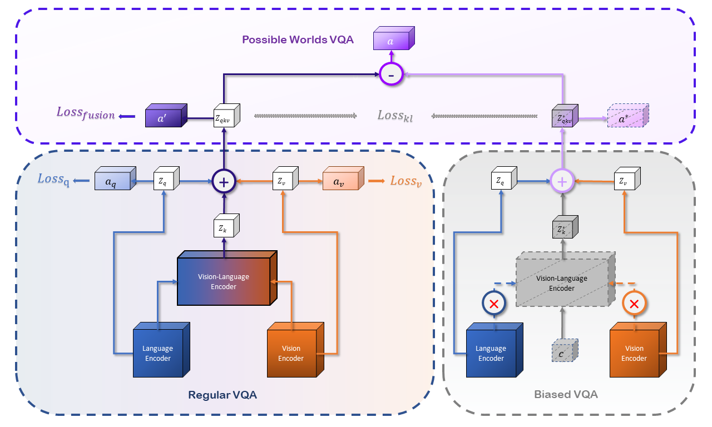

# Possible World VQA (PW-VQA)

This repository facilitates the reproduction of results from the PW-VQA paper. It incorporates code largely based on the implementations of [RUBi](https://github.com/cdancette/rubi.bootstrap.pytorch) and [CF-VQA](https://github.com/yuleiniu/cfvqa).

<p align="center">
  
</p>

## Table of Contents

1. [Installation](#installation)
2. [Training a Model](#training-a-model)
3. [Evaluating a Model](#evaluating-a-model)
4. [Acknowledgements](#acknowledgements)
5. [Citation](#citation)

## Installation

Run these numbered steps from the repository root using Bash. Training and
full evaluation require Linux (or WSL), an NVIDIA GPU, and a driver compatible
with the pinned CUDA 12.8 PyTorch wheels. The existing model calls CUDA directly.
Python 3.9.23 is installed automatically by the setup script.

1. Clone the repository and enter it:

   ```bash
   git clone https://github.com/ali-vosoughi/PW-VQA.git
   cd PW-VQA
   ```

2. Install the pinned setup tool, create `.venv`, install dependencies, and apply
   the bundled patches:

   ```bash
   python -m pip install uv==0.8.17
   bash scripts/setup.sh cu128
   source .venv/bin/activate
   ```

   For an installation/import check without CUDA, use `bash scripts/setup.sh cpu`
   instead and stop after step 3. On Windows, run setup in Git Bash and activate
   with `source .venv/Scripts/activate`. Native Windows is verified for CPU
   installation and smoke tests only; use Linux/WSL for model runs.

   `requirements.txt` pins the complete CPU dependency graph;
   `requirements-cu128.txt` pins the CUDA graph. `pyproject.toml` records the
   direct dependencies and Python constraint. Historical pins are retained where
   recorded; previously unspecified versions are a tested reconstruction, not
   a recovered paper environment. See [the reproduction report](REPRO_REPORT_2026-10-01.md)
   for provenance and verification limits. CLIP, LAVIS, and vit-pytorch are not
   imported by the released VQA code and are excluded.

3. Check the patches and runtime without downloading data or constructing models:

   ```bash
   python scripts/apply_patches.py --check
   python scripts/smoke_test.py
   ```

   Setup already runs these checks. `apply_patches.py` locates Bootstrap and BLOCK
   inside the active interpreter's environment, verifies their pinned versions,
   and installs the files listed in [patches/README.md](patches/README.md).
   Repeating `python scripts/apply_patches.py` leaves matching files untouched;
   `--check` makes no changes and fails on missing or changed files. Reapply after
   reinstalling either framework. No manual site-packages paths are needed.

4. Download the annotations and pre-extracted image features into the paths used
   by the supplied options:

   ```bash
   bash pwvqa/datasets/scripts/download_vqa2.sh
   bash pwvqa/datasets/scripts/download_vqacp2.sh
   ```

   These produce `data/vqa/vqa2`, `data/vqa/vqacp2`, and
   `data/vqa/coco/extract_rcnn/2018-04-27_bottom-up-attention_fixed_36`.
   The scripts require `wget` and `tar`; their upstream download endpoints were
   not exercised during the setup verification.

5. Fetch the pretrained Skip-Thought text encoder used by the configuration:

   ```bash
   mkdir -p data/skip-thoughts
   wget -P data/skip-thoughts http://www.cs.toronto.edu/~rkiros/models/dictionary.txt
   wget -P data/skip-thoughts http://www.cs.toronto.edu/~rkiros/models/utable.npy
   wget -P data/skip-thoughts http://www.cs.toronto.edu/~rkiros/models/uni_skip.npz
   ```

   These are upstream text-encoder weights, not PW-VQA checkpoints. The
   [Skip-Thought loader](https://github.com/Cadene/skip-thoughts.torch/blob/master/pytorch/skipthoughts/skipthoughts.py)
   also attempts these downloads automatically if the files are missing.

## Training a Model

6. Train PW-VQA with S-MRL on VQA-CP v2 (seed 2020, 22 epochs in the supplied config):

   ```bash
   python -m bootstrap.run -o pwvqa/options/vqacp2/smrl_pwvqa.yaml
   ```

   **Checkpoints are not released.** Training creates the following local files
   under `logs/vqacp2/smrl_pwvqa/`:

   - `options.yaml`, `logs.txt`, and `logs.json` record options and progress.
   - `_pwvqa_val_oe.json` records PW-VQA open-ended VQA accuracy; `_vq`, `_q`,
     `_v`, and `_all` files report the other branches.
   - `ckpt_last_model.pth.tar`, `ckpt_last_engine.pth.tar`, and
     `ckpt_last_optimizer.pth.tar` contain the last training checkpoint.

## Evaluating a Model

7. After training, evaluate its last checkpoint with this exact command:

   ```bash
   python -m bootstrap.run \
     -o logs/vqacp2/smrl_pwvqa/options.yaml \
     --exp.resume last \
     --dataset.train_split \
     --dataset.eval_split val \
     --misc.logs_name test
   ```

   Passing `--dataset.train_split` without a value sets it to `None`, disables
   training, and skips loading the optimizer checkpoint. Keep the saved options,
   model checkpoint, engine checkpoint, features, and annotations in their
   documented locations. In this code, `val` is the local name for the published
   VQA-CP v2 test split; use `val` for this command.

   The reported metric is overall open-ended VQA consensus accuracy, with Yes/No,
   Number, and Other breakdowns: see [Table I of the paper](https://pmc.ncbi.nlm.nih.gov/articles/PMC11485245/#T1)
   for PW-VQA with S-MRL. Read `eval_epoch.overall` from
   `logs/vqacp2/smrl_pwvqa/test_pwvqa_val_oe.json`. The metric process runs in the
   background, so this file may appear after the main command finishes.
   `accuracy_pwvqa_top1` is a separate single-answer proxy.

   The last-checkpoint command is the repository's documented evaluation path;
   a checkpoint corresponding to the paper table is not provided. Setup, imports,
   metric fixtures, and argument parsing have been checked on Windows CPU.
   Dataset downloads, GPU execution, training, checkpoint loading, and the paper
   score have not been verified in this repair.

## Acknowledgements

We thank the excellent works by [RUBi](https://github.com/cdancette/rubi.bootstrap.pytorch) and [CF-VQA](https://github.com/yuleiniu/cfvqa).

## Citation

If you find the Possible World VQA (PW-VQA) useful in your research, please consider citing our work:

```bibtex
@article{vosoughi2024cross,
  title={Cross Modality Bias in Visual Question Answering: A Causal View with Possible Worlds VQA},
  author={Vosoughi*, Ali and Deng*, Shijian and Zhang, Songyang and Tian, Yapeng and Xu, Chenliang and Luo, Jiebo},
  journal={IEEE Transactions on Multimedia},
  year={2024},
  publisher={IEEE}
}
```
