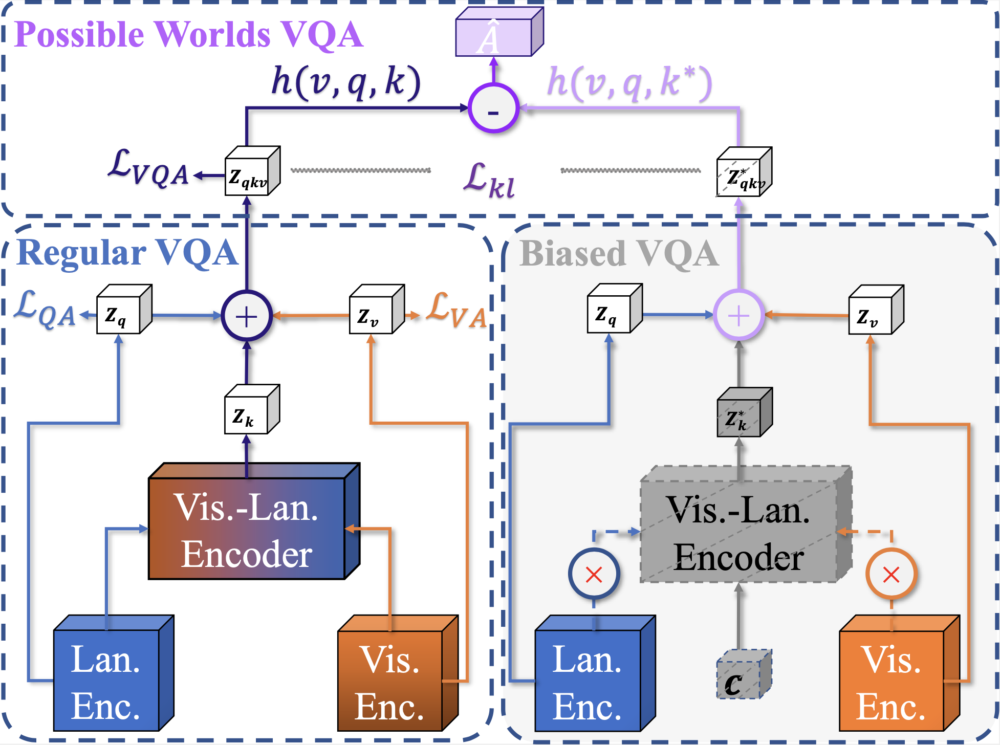

# Possible World VQA (PW-VQA)

<p align="center">
    
</p>

## Installation


### 1. Setup and dependencies

Install Anaconda or Miniconda distribution based on Python3+ from their downloads' site.

```bash
conda create --name pwvqa python=3.9
source activate pwvqa
pip install -r requirements.txt
```

You may also need to replace several files in the environment with the commands like the following (depending on where you create your environment)

```bash
!cp accuracy.py /usr/local/envs/pwvqa/lib/python3.9/site-packages/bootstrap/models/metrics
!cp -r external /usr/local/envs/pwvqa/lib/python3.9/site-packages/block/
```

### 2. Download datasets

Download annotations, images and features for VQA experiments:
```bash
bash pwvqa/datasets/scripts/download_vqa2.sh
bash pwvqa/datasets/scripts/download_vqacp2.sh
```

## Train a model

You can train our best model on VQA-CP v2 (PWVQA+SMRL) by running:
```bash?
python -m bootstrap.run -o pwvqa/options/vqacp2/smrl_pwvqa.yaml
```
Then, several files are going to be created in `logs/vqacp2/smrl_pwvqa/`:
- [options.yaml] (copy of options)
- [logs.txt] (history of print)
- [logs.json] (batchs and epochs statistics)
- [\_vq\_val\_oe.json] (statistics for the language-prior based strategy)
- **[\_pwvqa\_val\_oe.json] (statistics for PW-VQA)**
- [\_q\_val\_oe.json] (statistics for language-only branch)
- [\_v\_val\_oe.json] (statistics for vision-only branch)
- [\_all\_val\_oe.json] (statistics for the ensembled branch)
- ckpt_last_engine.pth.tar (checkpoints of last epoch)
- ckpt_last_model.pth.tar
- ckpt_last_optimizer.pth.tar


## Evaluate a model

There is no test set on VQA-CP v2, our main dataset. The evaluation is done on the validation set.

```bash
python -m bootstrap.run \
-o ./logs/vqacp2/smrl_pwvqa/options.yaml \
--exp.resume last \
--dataset.train_split ''\
--dataset.eval_split val \
--misc.logs_name test 
```


## Citation

If you find the Possible World VQA (PW-VQA) useful in your research, please consider citing our work:

```bibtex
@article{vosoughi2024cross,
  title={Cross Modality Bias in Visual Question Answering: A Causal View with Possible Worlds VQA},
  author={Vosoughi, Ali and Deng, Shijian and Zhang, Songyang and Tian, Yapeng and Xu, Chenliang and Luo, Jiebo},
  journal={IEEE Transactions on Multimedia},
  year={2024},
  publisher={IEEE}
}
